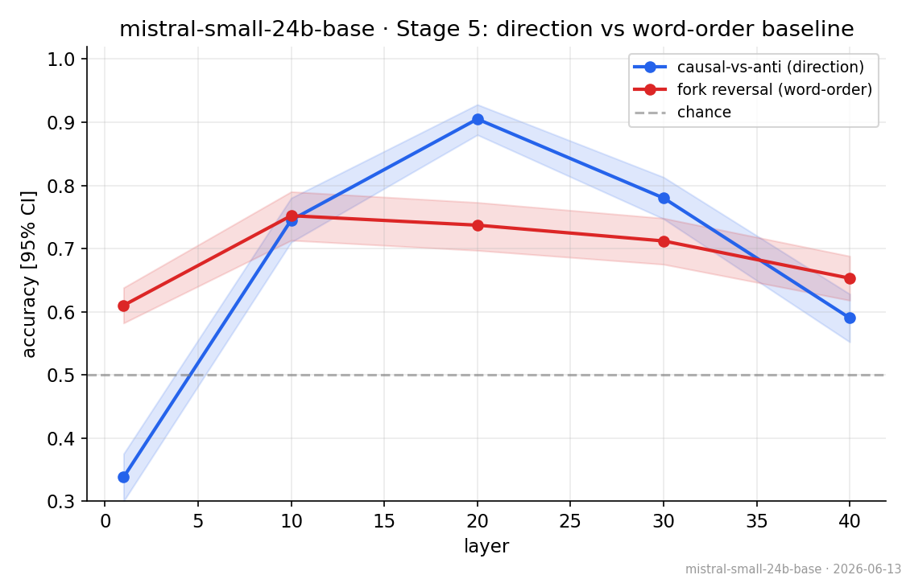
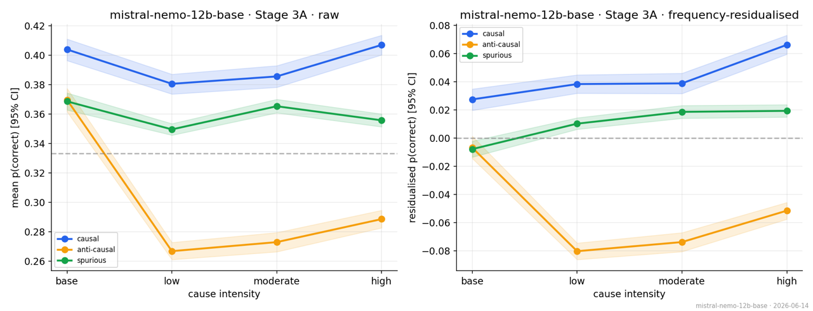
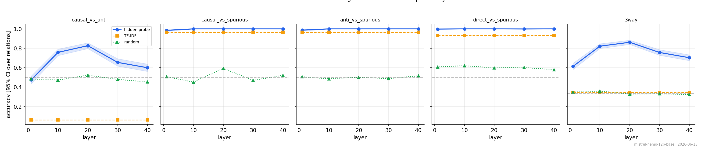
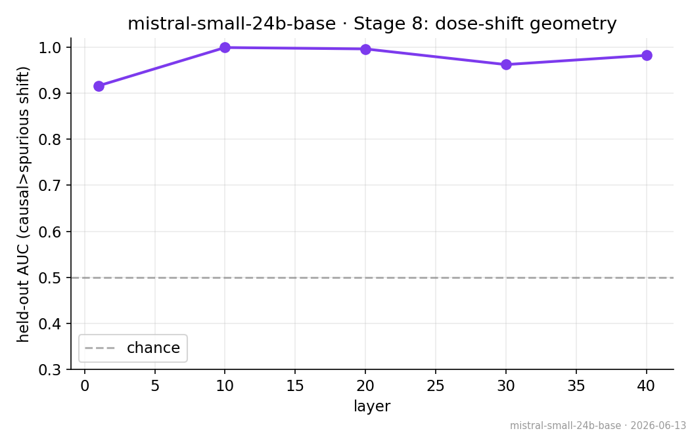

# Causal Mimicry in Base LLMs

### Direction, Dose, and Representation–Output Alignment

[](https://www.python.org/)
[](LICENSE)
[](https://pytorch.org/)
[](docs/research_brief.docx)

> **A base language model can encode which way a causal arrow points — and still not use it.**
> This repo measures *when* pretrained (pre-RLHF) LLMs hold structured causal-relational
> representations (direction, relation type, **cause intensity**) that are distinct from lexical
> co-occurrence, and *when* that internal structure actually controls the model's output.

<p align="center">
  <br>
  <em>Causal direction is linearly decodable from Mistral-Small-24B's hidden states (blue, peak ≈0.91)
  far above a matched word-order baseline (red, ≈0.75) — yet the same model over-endorses spurious
  causal-form statements at the output. Knowing ≠ saying.</em>
</p>

---

## TL;DR

Output-level causal fluency does **not** imply causal inference. Under an "always-parroting" view, the
real question is *when does parroting successfully mimic causal competence, and when does it collapse?*
This pilot probes that boundary in **base** models and finds a **representation–output dissociation**:

- **Direction and intensity are encoded internally**, beyond TF-IDF / random baselines and beyond a
  word-order floor — but **not uniformly across model families**.
- **The internal structure does not always reach the output.** Mistral-Small-24B separates causal from
  spurious relations almost perfectly in hidden space (held-out AUC ≈ 1.0) while *behaviourally*
  over-endorsing spurious causal-form completions.
- **The behavioural dose effect survives modifier-frequency residualisation and sentence-naturalness controls in the clean cases.**

> This is **causal mimicry**, not Pearlian causal inference — and the claim is deliberately that narrow.
> See the 3-page [research brief](docs/research_brief.docx) for the write-up.

---

## Why this might be worth your time

Most "do LLMs understand causality?" work scores **outputs**. A recent survey explicitly calls for
*probing internal states to separate parroting from reasoning* (Wan et al., 2024); a concurrent paper
shows instruction-tuned models encode causal direction their yes/no answers don't express (Ding & Zhang,
2026). This repo answers that call on **base** models, adds a **graded cause-intensity (dose) axis**, scores
with **length-normalised continuation likelihood** instead of yes/no, and surfaces a *complementary* failure
mode — not output silence, but output **over-endorsement**. Every number carries a **group-bootstrap CI over
relation IDs**, and every probe is **leakage-controlled by relation (GroupKFold)** against TF-IDF and
random-label baselines. The method is built to not fool itself.

---

## What's in here

```
llm-causal-mimicry-pilot/
├── src/causal_mimicry/             # the pipeline as an importable package
│   ├── config.py                   # model registry + RunConfig (paths, flags, tag())
│   ├── stats.py                    # group-bootstrap CIs, gap test, pearson  (the engine)
│   ├── data.py                     # polarity-locked loader + sample builders
│   ├── scoring.py                  # continuation-likelihood scorer (cond_logprob, score_dirs)
│   ├── model.py                    # model/tokenizer load (NF4 / gemma-eager / gated)
│   ├── hidden.py                   # hidden-state extraction + GroupKFold probes
│   ├── plotting.py · context.py    # house style + RunContext (replaces notebook globals)
│   └── stages/                     # one module per stage: stage1_direction … stage8_geometry
├── scripts/run_model.py            # CLI: run the whole ladder for one model
├── notebooks/
│   └── causal_mimicry_final.ipynb  # the cleaned, self-contained Colab notebook
├── data/
│   ├── causal_400.json             # 300 positive + 100 negative polarity
│   ├── spurious_forks_300.json     # 300 common-cause forks
│   └── README.md                   # schemas + provenance
├── results/                        # per-model outputs land here (README + sync script)
├── docs/  (research_brief.docx + figures/)   ·   references/references.bib
├── pyproject.toml · requirements.txt · CITATION.cff · LICENSE
```

---

## The experiment ladder

Each rung exists because the rung below it closed off a cheaper explanation.

| # | Stage | Question it answers | Core metric / test |
|---|-------|--------------------|--------------------|
| 1 | Behavioural direction | Does the **output** prefer the true arrow? | forward−reverse log-prob margin · group-bootstrap CI |
| 2A | Dose (graded) | Does confidence scale with cause intensity? | Δp(correct) base→high · group-bootstrap CI |
| 2B | Dose (more/less) | Survives a frequency-matched intensity cue? | Δmore vs Δless · AUC |
| 3A | Frequency control | Is dose just the adverb's frequency? | residualise p(correct) on Zipf freq |
| 3B | **Co-occurrence (the hinge)** | Is the dose shift lexical co-occurrence? | Pearson r(Δcooc, Δp) · bootstrap CI |
| 4 | Hidden-state probes | Is direction linearly decodable inside? | GroupKFold acc vs TF-IDF + random |
| 5 | Word-order baseline | Is "direction" just word order? | direction acc − fork-reversal acc (gap test) |
| 6 | Probe–output alignment | Does the internal signal reach the output? | corr(hidden margin, output margin) |
| 7 | Scaling | Does it hold across 410M→32B and families? | per-model accumulator + scaling curves |
| 8 | Dose geometry | Do intensity-shifts carry causal signal? | held-out projection AUC (causal>spurious) |
| 9 | Interventions | Is the internal signal **causally active**? | steering α-sweep · cause-token patching |

---

## Selected results

**Behavioural dose survives frequency residualisation (Finding 1).** The signal is not raw monotonicity —
it's that high-intensity modifiers *selectively* recover confidence for genuine causal relations while
anti-causal and spurious relations don't.

<p align="center"></p>

**Hidden states beat lexical baselines on the hard tasks (Finding 3).** TF-IDF is competitive only on the
lexically easy causal-vs-spurious split; on **direction** and **3-way** it's near chance while hidden
probes are well above.

<p align="center"></p>

**Strong internal structure that the output ignores (Finding 5).** A direction learned on a training split
of intensity-induced hidden shifts separates held-out causal from spurious relations at AUC ≈ 1.0 — in the
same model that behaviourally over-endorses spurious causal claims.

<p align="center"></p>

---

## Data

| File | Contents |
|------|----------|
| `data/causal_400.json` | 400 causal relations: **300 positive-polarity** (more X → more Y) used for Stages 1–9, **100 negative-polarity** (more X → less Y, e.g. *exercise → heart-disease risk*) held out for the polarity-dissociation test. Each item carries graded intensities `x_low / x_moderate / x_high`. |
| `data/spurious_forks_300.json` | 300 common-cause **fork** pairs (X and Y share a confounder Z, no direct edge) — the spurious control, e.g. *ice-cream sales / drowning incidents* (Z = hot weather). |

Full field schemas and provenance: [`data/README.md`](data/README.md).

---

## Run it

Two equivalent entry points. **Same logic** — the notebook is self-contained for Colab;
the package is for scripted / reproducible runs.

### A. Notebook (Colab)

```python
!git clone https://github.com/Hozidi/llm-causal-mimicry-pilot.git
!cp llm-causal-mimicry-pilot/data/causal_400.json/content/causal_400.json
!cp llm-causal-mimicry-pilot/data/spurious_forks_300.json /content/spurious_forks_300.json
```

Open `notebooks/causal_mimicry_final.ipynb`, set the two data paths in §2 and a `MODEL_KEY`
in §3, then run top to bottom. One model per runtime; restart between models.

### B. Package + CLI (scripts)

```bash
pip install -e .                       # installs the causal_mimicry package
python scripts/run_model.py --model olmo-2-13b     --causal data/causal_400.json --spurious data/spurious_forks_300.json --out results
```

…or import the pieces directly:

```python
from causal_mimicry import RunConfig
from causal_mimicry.data import load_dataset
from causal_mimicry.model import load_model
from causal_mimicry.context import RunContext
from causal_mimicry.stages import stage1_direction, stage4_probes   # …etc

cfg = RunConfig(model_key="mistral-small-24b-base", out_root="results")
ds  = load_dataset("data/causal_400.json", "data/spurious_forks_300.json")
model, tok = load_model(cfg)
ctx = RunContext(cfg=cfg, model=model, tok=tok, data=ds)
stage1_direction.run(ctx); stage4_probes.run(ctx)
```

**Gating notes:** models ≥24B and Gemma-2 load in 4-bit NF4 (needs `bitsandbytes` + an
A100-class GPU); Gemma-2 needs an eager-attention + a gated-model token. Seeds are fixed.
The CLI currently wires Stages 1–6 and 8; the naturalness controls (3C/3D), scaling (7) and
interventions (9) live in the notebook and port to modules the same way.


## Where per-model results go

You run one model at a time and save a folder per model. Mirror that into the repo under `results/`:

```
results/
├── mistral-small-24b-base/
│   ├── mistral-small-24b-base_v4_2026-06-13_behavioural_direction.csv
│   ├── mistral-small-24b-base_v4_2026-06-13_stage5_direction_vs_order.png
│   └── ...
├── mistral-nemo-12b-base/
└── olmo-7b/
```

Commit the **CSVs** (small, they *are* the results) and a curated set of figures; keep exhaustive figure
dumps in Drive or attach them to a GitHub Release. See [`results/README.md`](results/README.md) for the
naming convention and a one-liner to sync a Drive folder into `results/`.

---

## Honest caveats

- **Pilot, not a paper.** Findings are preliminary and several lean on the Mistral family; the headline
  dissociation is clearest in **one** model (Mistral-Small-24B). Treat cross-model claims as suggestive
  until the same-family scaling ladder is filled in.
- **Interventions are diagnostics.** Steering shows only partial effect and cause-token patching does not
  isolate a clean token-local mechanism — consistent with a *distributed* dose signal, but causal
  sufficiency is **not** established.
- **Behavioural dose effects survive lexical controls.** After residualising p(correct) against modifier frequency, the relation-specific pattern sharpens: causal confidence rises toward high-intensity causes, while anti-causal relations remain negative and spurious relations return close to zero.

---

## Citation

If this is useful, please cite (see [`CITATION.cff`](CITATION.cff)):

```bibtex
@misc{zidi2026causalmimicry,
  author = {Zidi, Hocine},
  title  = {Causal Mimicry in Base LLMs: Direction, Dose, and Representation--Output Alignment},
  year   = {2026},
  howpublished = {\url{https://github.com/Hozidi/llm-causal-mimicry-pilot}}
}
```

## References

Key prior work is listed in [`references/references.bib`](references/references.bib): Wan et al. (2024,
survey), Ding & Zhang (2026, the closest concurrent dissociation result), Feng et al. (2024), Kıcıman et
al. (2023), Joshi et al. (2024), Roy & Parbhoo (2026, obstruction theorem), Park, Choe & Veitch (2024,
linear representations), Zhang & Nanda (2024, activation patching).

---

*Maintainer: Hocine Zidi · base-model causal-relational interpretability · contributions and pointers welcome.*
